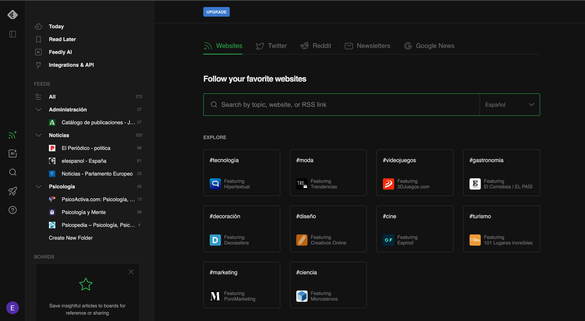
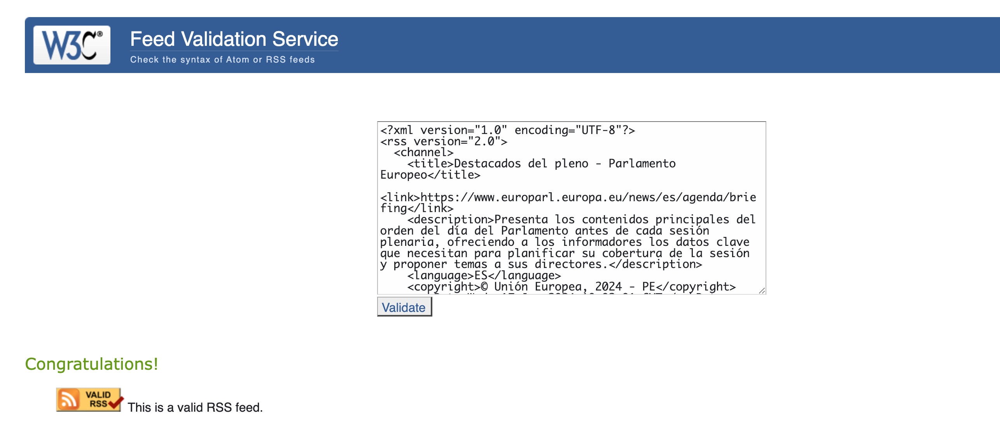
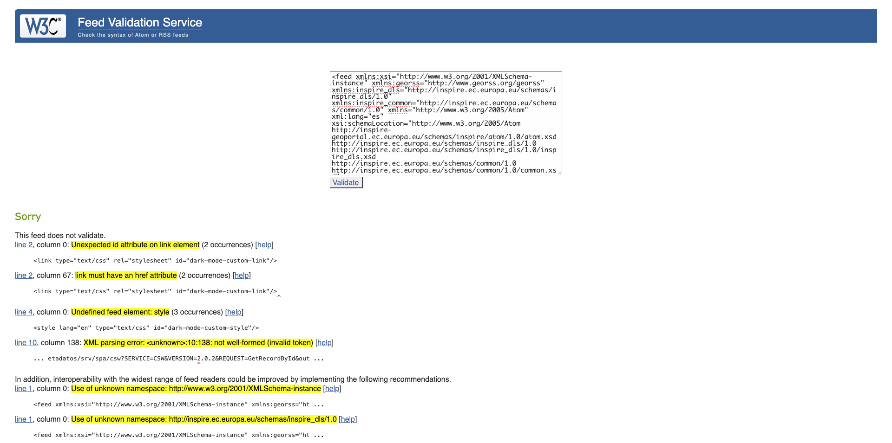

En esta práctica, vamos a realizar diversas tareas:
1. En primer lugar añadiremos varias fuentes relacionadas con un tema personal y original, junto a una categoría "noticias" con tres fuentes relacionadas a este tema a feedly.com,
2. Después, buscaremos un fichero XML con formato RSS y otro ATOM, lo subiremos al repositorio y comprobaremos su validez.
3. Por último, haremos un listado de las etiquetas principales, organizadas de un fichero RSS
4. Por último, haremos un listado de las etiquetas principales, organizadas de un fichero ATOM

# 1. FEEDLY CON LAS FUENTES ELEGIDAS SOBRE EL TEMA PERSONAL Y EL DE NOTICIAS


# 2. VALIDACIONES DE LOS FICHEROS XML CON FORMATO RSS Y ATOM
1. FICHERO RSS

2. FICHERO ATOM


# 3. LISTADO DE LAS ETIQUETAS PRINCIPALES DE UN FICHERO RSS
Con un ejemplo de un fichero RSS, vamos a escribir un pequeño documento XML comentando para qué sirve cada etiqueta:
```
<?xml version="1.0" encoding="UTF-8"?>
<!-- Declaracion de RSS -->
<rss version="2.0">
   <!-- Declaracion del canal -->
   <channel>
      <!-- Titulo del Canal -->
      <title>rss-example</title>
      <!-- Descripcion del Canal -->
      <description>Ejemplo de un RSS hecho a mano</description>
      <!-- Enlace al sitio del Feed RSS -->
      <link>https://ejemplo-rss.glitch.me/</link>
      <!-- Elementos de feed, estos se muestran en los lectores de RSS  en el orden que esten aquí de arriba hacia abajo -->
      <!-- Elemento individual del Fedd -->
      <item>
         <!-- Titulo del elemento del feed -->
         <title>Prueba Final</title>
         <!-- Descripcion de la actualizacion del sitio que este elemento representa, puede contener cuanto texto e imagenes necesite-->
         <description>Descripción detallada de los elementos de un Feed RSS</description>
         <!-- Enlace a la seccion del sitio-->
         <link>https://ejemplo-rss.glitch.me/</link>
         <!-- Fecha de publicación -->
         <pubDate>Mon, 30 Dic 2019 23:00:00 EST</pubDate>
      </item>
      <item>
         <title>Demostración</title>
         <description>Abriremos nuestro sitio web desde un lector RSS y veamos que pasa</description>
         <link>https://ejemplo-rss.glitch.me/</link>
         <pubDate>Sun, 29 Dic 2019 15:00:00 EST</pubDate>
      </item>
      <item>
         <title>Enlazar el feed desde el encabezado HTML</title>
         <description>Como enlazar el feed desde el encabezado de modo que los lectores RSS lo puedan localizar</description>
         <link>https://ejemplo-rss.glitch.me/</link>
         <pubDate>Sat, 28 Dic 2019 15:00:00 EST</pubDate>
      </item>
      <item>
         <title>Ejemplo de un Feed RSS</title>
         <description>Un ejemplo del codigo completo de un feed RSS</description>
         <link>https://ejemplo-rss.glitch.me/</link>
         <pubDate>Fri, 27 Dic 2019 15:00:00 EST</pubDate>
      </item>
      <item>
         <title>Multimedia en RSS</title>
         <description><![CDATA[Ejemplo de como agregar una imagen al RSS, hacemos uso de CDATA para poner codigo HTML dentro del RSS, como la siguiente imagen ]]></description>
         <link>https://ejemplo-rss.glitch.me/</link>
         <pubDate>Thu, 26 Dic 2019 14:00:00 EST</pubDate>
      </item>
      <item>
         <title>Etiquetas de un Feed RSS</title>
         <description>Que etiquetas forman un feed RSS</description>
         <link>https://ejemplo-rss.glitch.me//</link>
         <pubDate>Wed, 25 Dic 2019 14:00:00 EST</pubDate>
      </item>
      <item>
         <title>¿Que es un feed RSS?</title>
         <description>Explicación de que es un Feed RSS</description>
         <link>https://ejemplo-rss.glitch.me//</link>
         <pubDate>Thu, 24 Dic 2019 13:00:00 EST</pubDate>
      </item>
      <item>
         <title>Anunciando tutorial de como hacer un RSS a mano</title>
         <description>Anunciando tutorial de como hacer un RSS a mano</description>
         <link>https://ejemplo-rss.glitch.me//</link>
         <pubDate>Mon, 23 Dic 2019 08:00:00 EST</pubDate>
      </item>
   </channel>
</rss>
```

Para enlazar el feed desde el encabezado se hace con un elemento link tipo type="application/rss+xml", si lo localiza el lector RSS sabrá que esa es la ruta al feed RSS del sitio y lo desplegará.
```
<head>
    <title>Ejemplo Feed RSS</title>
    <meta charset="utf-8" />
    <meta http-equiv="X-UA-Compatible" content="IE=edge" />
    <meta name="viewport" content="width=device-width, initial-scale=1" />
    
    <!-- Enlazamos el Feed RSS a la pagina -->
    <link rel="alternate" type="application/rss+xml" title="RSS-example" href="rss.xml" />
    
  </head>
```

# 4. LISTADO DE LAS ETIQUETAS PRINCIPALES DE UN FICHERO ATOM

Consiste en:  
- La declaración XML.
- El elemento raíz <feed> con algunos elementos para sus metadatos. 
- El contenido en forma de entradas con elementos 
`<entry>`  
- El documento Atom comienza con la declaración XML. 
```
<?xml version="1.0" encoding="utf-8"?>
```
- A  continuación  viene  el  elemento  raíz  <feed> en  el  que  se  define  el  espacio  de 
nombres y se incluyen los metadatos del feed
```
<feed xmlns="http://www.w3.org/2005/Atom"
xml:lang="es"
xml:base="http://www.ejemplo.org">
```
En  este  elemento  podemos  utilizar  el  atributo  xml:lang para  indicar  el  idioma  del 
feed y xml:base para establecer la URL por defecto del documento. El objetivo del atributo 
xml:base es utilizar URL relativas en otros elementos del feed.
Para los metadatos del feed se emplean una serie de elementos: 
- `<id>` → Identificador único del feed. Es obligatorio.
- `<title>` → Título del feed. Es obligatorio. 
- `<link>` → Enlace a un recurso externo.
- `<updated>` → Fecha y hora de la última actualización. Es obligatorio. 
- `<author>` → Autor del feed. Puede haber varios.
- `<name>` → Nombre del autor. Va dentro del elemento 
- `<author>`

### EJEMPLO
```
<?xml version="1.0" encoding="utf-8"?> 
<feed xmlns="http://www.w3.org/2005/Atom"
    xml:lang="es"
    xml:base="http://www.ejemplo.org"> 
<title>Ejemplo Feed</title>
<link href="http://ejemplo.org/"/>
<updated>2020-12-13T18:30:02Z</updated> 
<author>
    <name>Nombre autor</name> 
</author>
<id>urn:uuid:60a76c80-d399-11d9-b93C-0003939e0af6</id> 

<entry>
    <title>Título de la entrada</title>
    <link href="http://ejemplo.org/2020/12/13/atom03"/> 
    <id>urn:uuid:1225c695-cfb8-4ebb-aaaa-80da344efa6a</id> 
    <updated>2020-12-13T18:30:02Z</updated>
    <summary>Algún texto resumen.</summary> 
</entry>
…
</feed>
```