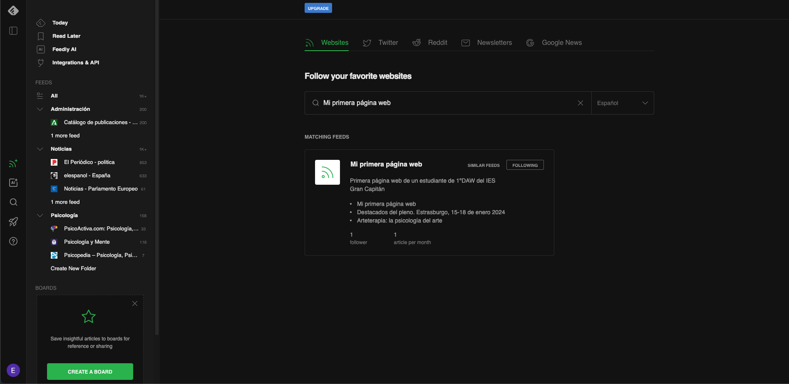

# UD4 A3 Creación de canales de contenidos. Formato Atom

Ya has creado un documento RSS para crear un canal de contenidos. Ahora repite el proceso pero con el formato Atom. 

## Atom
Atom es un formato de documento basado en XML que describe listas de    información conocida como "feeds". Los feeds se componen de una serie de
elementos, conocidos como "entradas", cada uno con un conjunto de     metadatos.

Atom se usa para la sindicación de contenidos Web como blogs y titulares de noticias.
En algunos sitios se recomienda el uso del formato de Atom para la redifusión web. Este término hace referencia a dos estándares relacionados:

- El Formato de Redifusión Atom. Es un fichero en formato XML
- El protocolo de publicación Atom. Es un protocolo simple basado en HTTP.

El primer formato de fuente web fue RSS y sigue siendo el más común. Es un formato tan popular que es común que el término RSS sea usado erróneamente para referirse a fuente web, independientemente de que el formato de dicha fuente sea RSS o no. Sin embargo, Atom presenta las siguientes ventajas sobre él:

- El código se puede reutilizar en otros XML, una idea pensada para favorecer su extensión.
- Ofrece información sobre qué tipo de contenidos envía. RSS no se puede indicar si se trata de texto plano, texto con etiquetas HTML o si es un contenido audiovisual, como un podcast o un vídeo. Atom sí permite explicitarlo y con ello facilita su posterior empleo por parte del usuario.
- Se pueden agregar diversas fuentes dentro de un contenido y, al mismo tiempo, mantener la información de su creador intacta, con enlaces al sitio original.
- Dispone de más opciones de publicación y se marca con claridad si se envía sólo el titular del texto con un enlace, se le añade el primer párrafo o se manda íntegro todo el contenido. En el RSS, en cambio, no hay una forma de comunicar este dato.
- Atom facilita la exportación de los contenidos generados por un medio a otro blog o sitio web.
- Estandariza el código que se debe introducir para que los navegadores reconozcan la existencia de sindicación dentro de un sitio web, para después mostrar el icono correspondiente en la barra de navegación.   

## Barreras para la adopción de Atom frente a RSS
A pesar del surgimiento de Atom como un estándar propuesto por IETF y la decisión de empresas importantes como Google de adoptar Atom, el uso de los formatos RSS más antiguos y mejor conocidos ha continuado. Hay varias razones para esto:

- El soporte de RSS 2.0 para  enclosures condujo directamente al desarrollo de podcasting. Si bien muchas aplicaciones de podcasting, como iTunes, admiten el uso de Atom 1.0, RSS 2.0 sigue siendo el formato preferido.
- Muchos sitios eligen publicar sus feeds en un solo formato. Por ejemplo, CNN y The New York Times ofrecen sus fuentes web solo en formato RSS 2.0.
- Los artículos de noticias sobre fuentes de sindicación web han utilizado cada vez más el término "RSS" para referirse genéricamente a cualquiera de las diversas variantes del formato RSS, como RSS 2.0 y RSS 1.0, así como al formato Atom. 
 
## Requisitos de la entrega
Realizarás una entrega de un fichero con formato Atom con los siguientes elementos:
- Los elementos obligatorios de los metadatos del feed.
- Autor y enlace del feed.
- Categoría y derechos del feed.
- 4 entradas, como mínimo, con diferentes orígenes y los siguientes elementos.


  - Los elementos obligatorios de la entrada.
  - Autor y fuente de la entrada.
  - Contenido. Los artículos alternarán los siguientes tipos de contenidos: 
    - Una página web externa, 
    - código HTML, 
    - un archivo pdf y 
    - un archivo multimedia (audio o vídeo).
     
## Validación
Este es el [servicio de validación de fuentes](https://validator.w3.org/feed/) W3C, un servicio gratuito que verifica la sintaxis de las fuentes Atom o RSS. En la parte inferior veremos el enlace the “This is a valid Atom 1.0 feed.” banner en el que podemos descargar el logo de Atom válido para utilizarla en nuestra web. A continuación nos ofrece un elemento de HTML para incluir en nuestra web que permitirá al usuario comprobar la validación de nuestro RSS.

Adjunta una captura de pantalla con la validación del feed en el validador de W3C.


## Publicación
Para hacerlo accesible a los demás, y una vez escrito y validado nuestro archivo hay que subirlo al servidor Web. Usa el repositorio con el hosting activo (Tarea UD3 A6. Mi sitio. Github pages) Para ello:

- Inserta un enlace en la página de inicio de nuestra web que apunte al archivo Atom para poder consultarlo a través del navegador. Usa el icono estándar de sindicación de contenidos

```htm
<p><a href="ud4_a3.xml">
   
</a></p>
```
- Inserta un elemento en la cabecera de la página de inicio para que los lectores o agregadores RSS suscribirse a nuestro feed. Dentro del elemento de la página de inicio de nuestro sitio web pondremos el siguiente elemento.
```htm
<link href="ud4_a3-atom.xml" type="application/atom+xml" rel="alternate" title="Sitewide Atom feed" />
```
Indica aquí la url de tu sitio web.  
- [URL sitio web](https://iesgrancapitan-llmm.github.io/mi-primera-pagina-web-Hanaede/)

## Suscripción
Utiliza el lector/agregador feedly para añadir el fichero RSS que has creado.

Muestra una captura del contenido de la sindicación del contenido

##### Introducción del enlace del GitHub Page para la sindicalización

##### Matching feeds

##### Feed


De interés:
- https://datatracker.ietf.org/doc/html/rfc4287
- http://www.intertwingly.net/wiki/pie/Rss20AndAtom10Compared
- https://validator.w3.org/feed/docs/atom.html#sampleFeed
- https://www.juntadeandalucia.es/servicios/madeja/sites/default/files/historico/1.3.1/contenido-pauta-95.html
